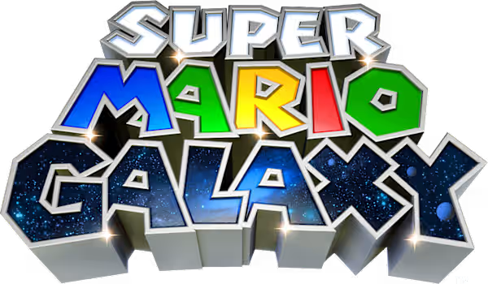

# Mario Power Tennis Patch

Play **New Play Control! Mario Power Tennis** (Wii) with a **GameCube controller** — using
the controls of the original GameCube game — or with a **Classic Controller**
instead of the Wii Remote motion swings. Works with the USA (`RMAE01`), European
(`RMAP01`) and Japanese (`RMAJ01`) releases, and each patch is optional.

The patches are applied to your own copy of the game: drop a clean `.wbfs` or
`.iso` onto the patcher and play the result on a Wii (USB loader) or in
Dolphin. Nothing from the game is included in this repository.



## How it works, in one paragraph

The game was written for a Wii Remote with a Nunchuk and motion swings. The patches rewrite
whatever controller you are holding into a Wii Remote + Nunchuk sample — right where the Wii's
`KPAD` library reads its samples — so the game runs its ordinary Nunchuk movement and menu code.
In addition, racket swings and shot types (Topspin, Slice, Flat, Lob, Drop, Power Shots) are
driven directly by button presses (A, B, X/C, L, R, Z), reproducing the controls of the original
GameCube classic. See [docs/TECHNICAL.md](docs/TECHNICAL.md) for the details.

## Controls

### GameCube controller (port 1)

The layout follows the original GameCube game.

| Input | Action |
| --- | --- |
| Control stick | Move player on court · menu navigation |
| C stick | Menu cursor / pointer |
| A | Topspin swing · toss ball on serve · confirm in menus |
| B | Slice swing · cancel in menus |
| X / A+B | Flat shot |
| Y | Lunge |
| L | Dive / manual reach |
| R | Offensive Power Shot (when meter is charged) |
| Z | Defensive Power Shot (when meter is charged) |
| Start | Pause |
| D-pad | Menu navigation |

### Classic Controller

| Input | Action |
| --- | --- |
| Left stick | Move player on court |
| Right stick | Menu cursor / pointer |
| A | Topspin swing · toss ball on serve · confirm in menus |
| B | Slice swing · cancel in menus |
| X | Flat shot |
| Y | Lunge |
| ZL / L | Dive / manual reach |
| R / ZR | Offensive / Defensive Power Shots |
| + | Pause |
| − | Lunge / toggle manual mode |
| HOME | HOME Menu |
| D-pad | Menu navigation |

With a Classic Controller on a Wii U (vWii) injection, enable *Force Classic
Controller Connected*.

## Installing

### Patch your disc image

You need a clean `.wbfs` or `.iso` of the game. Run the patcher GUI
(needs Python 3 with tkinter and [Wiimms ISO Tool](https://wit.wiimm.de/) (`wit`) on your `PATH`):

```bash
python3 tools/gui.py
```

Tick the patches you want, then drop the image onto the window (or click to
choose it). The patcher checks the disc id, patches `sys/main.dol`, rebuilds the
image in the same format and replaces your file, keeping the original next to
it as `<name>.bak`.

There is a command-line twin:

```bash
python3 tools/patch_disc.py "Mario Power Tennis (USA) (En,Fr,Es).wbfs" --cc --gc
```

### Gecko codes (Dolphin)

Copy `codes/<disc id>.ini` (`RMAE01`, `RMAP01` or `RMAJ01`) into Dolphin's
`GameSettings` folder and enable the codes under **Properties → Gecko Codes**.
The two codes are independent. Set GameCube Port 1 to a Standard Controller
(for the GameCube patch). A Wii Remote is optional for the GameCube patch.

The same codes are in `codes/<disc id>.txt` in the plain layout loaders read.

### Riivolution

`riivolution/<disc id>.xml` is a Riivolution patch with one switch per feature.
Put it in your Riivolution folder (or Dolphin's `Load/Riivolution`) and enable
the options you want.

### Which release do I have?

The disc id is the first six characters of the disc (`RMAE01` USA, `RMAP01`
Europe/Australia, `RMAJ01` Japan). `python3 tools/patch_disc.py` and the GUI read
it for you.

## Limits

- The GameCube controller works with **no Wii Remote connected at all**; with one
  connected, the remote's own buttons still work alongside the pad. GameCube
  port 1 drives player 1.
- Without a Wii Remote there is no HOME button (the HOME Menu belongs to the
  remote) and no rumble.
- Plug the GameCube controller in **before** starting the game; hot-plugging is
  not handled.
- While a patched controller is in use, the cursor follows the stick on menus.
- The Classic Controller still plugs into a Wii Remote, so that patch needs one.

## Repository layout

| Path | What |
| --- | --- |
| `src/` | the PowerPC routines (devkitPPC assembly) and the per-release builders |
| `tools/` | the patcher, GUI, Gecko / Riivolution generators and the checks |
| `tools/prebuilt/` | the patch data the patcher ships (generated from `src/`) |
| `codes/`, `riivolution/` | generated Gecko code lists and Riivolution patches |
| `lab/` | automated Dolphin test harness and GDB stub memory reader |
| `docs/TECHNICAL.md` | how the patches work |

Rebuilding the patch data from source needs devkitPPC and your own `main.dol`
dumps; end users need neither:

```bash
python3 tools/gen_prebuilt.py
python3 tools/build.py
python3 tools/check.py
python3 tools/verify.py
```

## License

MIT, see [LICENSE](LICENSE).

### Modded images

Disc patchers match the first four characters of the game ID (ID4), so mods can change the last two characters. The original disc ID and filename are preserved. Revision and executable patch-site checks still apply; mods that change required code may be incompatible.
